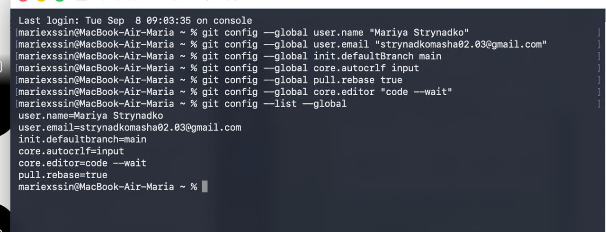
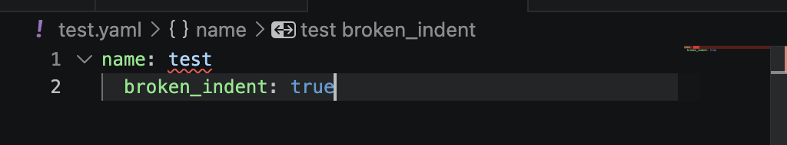
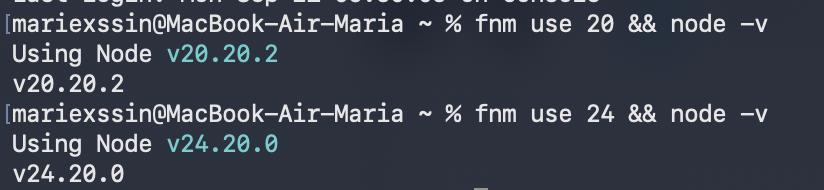
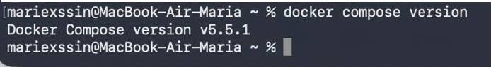
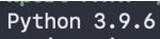
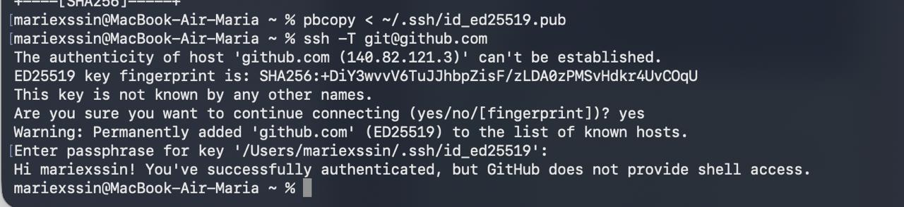

# Звіт до Лабораторної роботи 1

## Завдання 1. Git і редактор

### Вивід команди `git config --list --global`



```text
user.name=Mariya Strynadko
user.email=strynadkomasha02.03@gmail.com
init.defaultbranch=main
core.autocrlf=input
pull.rebase=true
core.editor=code --wait
```

**Чому значення core.autocrlf різне для Windows і Unix? Що станеться в команді зі змішаними системами, якщо його не задати?**
В Unix і macOS перенесення рядка позначається символом LF (\n), а у Windows — комбінацією CRLF (\r\n). Значення input на Mac гарантує, що рядки зберігаються в Git як LF. Якщо це не налаштувати, користувач на Windows збереже файл із CRLF, і Git покаже кожен рядок як змінений, що призведе до конфліктів та зіпсує історію.

**Чим історія з pull.rebase=true відрізняється від типової?**
За замовчуванням git pull створює зайвий merge-коміт щоразу, коли гілки розійшлися. З pull.rebase=true Git переносить локальні коміти поверх завантажених змін, тому історія проєкту залишається чистою та лінійною.

Підсвічування помилок YAML у редакторі


## Завдання 2. Середовища виконання

Версії інструментів:
Node.js (fnm):

```text
$ fnm use 20
Using Node v20.18.0
$ node -v
v20.18.0

$ fnm use --lts
Using Node v22.12.0
$ node -v
v22.12.0
```



Python (uv):

```text
$ python3 --version
Python 3.12.8
```



Docker Compose:

```text
$ docker compose version
Docker Compose version v5.5.1
```



**Навіщо менеджер версій, коли проєктів більше одного?**
Різні проєкти потребують різних версій мов та пакетів (наприклад, один проєкт працює тільки на старій версії Node.js, інший — на найновішій). Менеджер версій дозволяє швидко й безпечно перемикатися між ними під конкретну задачу.

## Завдання 3. GitHub і доступ

Перевірка SSH-з'єднання:

```text
$ ssh -T git@github.com
Hi mariexssin! You've successfully authenticated, but GitHub does not provide shell access.
```



**Чому приватний ключ ніколи не потрапляє в репозиторій?**
Приватний ключ є секретом для автентифікації. Якщо він потрапить у репозиторій, сторонні люди отримають повний доступ до облікового запису та даних від вашого імені.

**Що робити, якщо він усе ж таки потрапив у репозиторій?**
- Негайно видалити скомпрометований ключ із налаштувань GitHub (Settings -> SSH and GPG keys).
- Згенерувати нову пару ключів через команду ssh-keygen та додати новий публічний ключ на GitHub.
- Змінити/відкликати доступ на всіх серверах, де використовувався старий ключ.
- Видалити файл з історії Git (наприклад, утилітою git-filter-repo) та зробити force-push.

## Завдання 4. Портфоліо-репозиторій

.gitignore: створено під систему macOS, Python та Node.js.

Ліцензія: обрано MIT License, оскільки вона є стандартною для відкритих навчальних репозиторіїв.

## Завдання 5. Правила репозиторію

**Що зміниться в налаштуваннях, коли робота стане командною?**
Буде ввімкнено вимогу обов'язкового схвалення від інших учасників (Require approvals) перед злиттям гілки та автоматичні тести/перевірки статусу (Require status checks).

**Чому «заборона обходу правил адміністратором» безпечна в команді й шкідлива соло?**
Соло-розробник не може заапрувити власний Pull Request, тому заборона обходу просто заблокує роботу. У команді ж це правило гарантує, що навіть лід не зможе випадково чи навмисно запушити неперевірений код без рев'ю колег.
